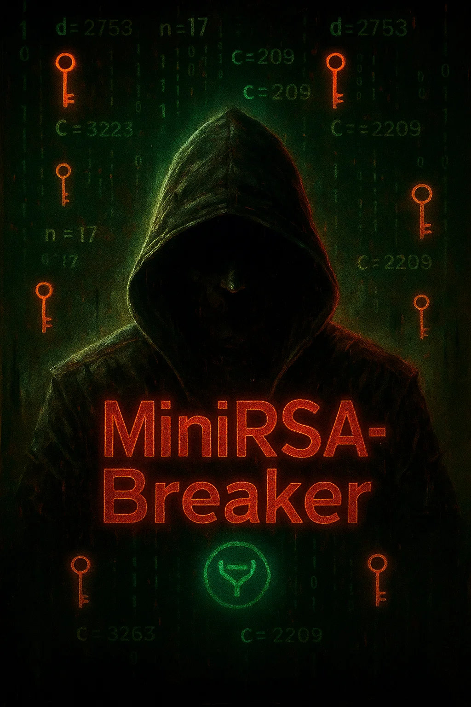

# 🔐 MiniRSA_Breaker

**All students and educators welcome.**  
Build understanding through **math, logic, and real cryptographic theory.**

**Category:** Cryptography / Educational Visualization  
**Tech Stack:** Python, PyQt6  
**Author:** [Justin Guida](https://github.com/jguida941)  
**Resume:** [View My Live Resume on Indeed →](https://profile.indeed.com/p/justing-yqigd8r)

---

### 🧠 Designed by:

*When Bool von Braun, Einstein, Ramanujan, Curie, Hawking, Turing, Gödel, Sagan, Tesla, Newton, Boole’s half-cousin, Schrödinger (or not), Feynman (if he felt like it), Dirac, Oppenheimer, Babbage, Lovelace, Gauss, Noether, Euler (circuits broken), Poincaré, Hilbert, Cauchy, Riemann, Leibniz, Maxwell, Faraday, Planck, Bohr, Heisenberg, de Broglie, Born, Weyl, Witten, Milnor, and Wittenoki had a baby… and that baby was also Rick Bobby.*

### I was born the Supreme Intelligence of Time. Justin Guida.

<h3> Statement from the Supreme Intelligence:</h3>

<pre><code>
Wasssup ya mf nerds Lets code before my computer explodes ya feeel me?

And my computer just fried from benchmarking a Mersenne prime on a Mac 
with Spotlight, on LETS GOOOOOO 🤘

MAC IS THE BEST BRO 48gb ram and leaking memory from the daemons bro it 
design bro, STEVE JOBS BRO,  
Mac bro,  
steve bro,  
iphone shiny iphone, mac bro
</code></pre>

---




This project enables **interactive RSA encryption and decryption**, with full step-by-step visual feedback.

**Use it to:**
- **Teach** RSA key concepts  
- **Break down** modular exponentiation  
- **Compare** **weak vs. strong keys**


  - Whether you're a **teacher**, a **CS student**, or just **someone fascinated by how passwords work**,  
**this tool was built for you**

> ⚠️ **This won't teach you how to break secure RSA encryption.  
> But... with the right math and curiosity, thats  different story, lets keep it at that** 
 

<br clear="left">


---


# ✨ Features

**RSA Key Generation**  
Generate custom or random small prime keys instantly.

**Modular Exponentiation Engine**  
Performs `c = m^e mod n` and `m = c^d mod n` using Python’s `pow()` function, real, fast RSA behavior.

**Character Mapping System**  
Maps characters **A–Z** to integers **01–26**, with optional symbol support for extended messages.

**Encryption & Decryption Panels**  
Visualize the full message transformation — from plaintext to ciphertext and back,  in real time.

**Step-by-Step Math Breakdown**  
Each stage of RSA math is clearly explained and animated for learning purposes.

**Error Handling + Input Validation**  
Smart checks catch invalid primes, characters, and unsupported input types, with helpful messages.

**100% Offline Application**  
Runs entirely on your device , no web server, no uploads, just fast, secure local computation.

**Debug Mode & Educational Hints**  
Toggle debug mode to show raw values, intermediate results, and contextual explanations at every step.

# 📸 Screenshots

## Main Interface RSA Setup  
**Define primes, generate public/private keys, and view entropy ratings in real time.**


---

## Encryption Panel  
## Watch your message get encrypted character by character using modular exponentiation.


---

## Decryption Panel  
## Reverse the cipher text and view RSA logic in reverse using your private key.


---

## 🚀  How to Run:

Follow these steps to launch **MiniRSA_Breaker** locally:

### 1. Clone the Repository
```bash
git clone https://github.com/jguida941/MiniRSA_Breaker.git
cd MiniRSA_Breaker
```

### 2. Create a virtual environment (recommended)
```bash
python3 -m venv venv
source venv/bin/activate  # On Windows: venv\Scripts\activate
```

### 3. Install dependencies
```bash
pip install -r requirements.txt
```

### 4. Launch the app
```bash
python rsa.py
```
##  How to it really Runs on macOS:

<h2>🗑️🔥 How to Run on macOS:</h2>

<p>App runs fully offline  no network needed, just on Steve Jobs’ soul, plus splotlight prob bricked your shit already.</p>

<pre><code>
[BOOT]    Initializing MiniRSA_Breaker v1337.420.69
[INFO]    Benchmarking Mode: ⚡ Mersenne Prime Detected
[WARNING] macOS daemons detected suspicious genius at PID 1337
[ALERT]   RAM leaking ideas per nanosecond — cannot patch intelligence overflow
[SYS]     Spotlight tried to index thought… failed.
[SYS]     launchd attempted to sandbox the Supreme Intelligence… denied.
[CRITICAL] GUI kernel detected sarcasm-to-math compiler at 98% CPU
[ALERT]   SYSTEM DESIGN OVERRIDE ENABLED
[ALERT]   ML mode activated without user consent — it’s thinking faster than TensorFlow
[DEBUG]   Logger overwhelmed, fell back to writing on nearest napkin
[FAIL]    Apple M4 throttled due to raw IQ — fan speed insufficient for this much truth
[INFO]    Transferring control to: Bool von Braun Einstein Ramanujan, The S.i.T.
[STATUS]  RUNNING IN GODMODE 
</code></pre>

## 📄 License: [CC BY-NC 4.0](https://creativecommons.org/licenses/by-nc/4.0/)

© 2025 Justin Guida  
This project is licensed under the **Creative Commons Attribution-NonCommercial 4.0 International License**.

---

###  You May:
-  **Share** — Copy, distribute, and share the code  
- **Adapt** — Remix, transform, or build upon it for personal or academic purposes  

###  You May Not:
- Use this work for commercial purposes  
- Sell, rebrand, or repackage this project for profit  

###  You Must:
- Credit the original author clearly:
  - **Name:** Justin Guida  
  - **Year:** 2025  
  - **GitHub:** [https://github.com/jguida941](https://github.com/jguida941)

---

##  Educational Terms

Educators and students are encouraged to:
- Use this tool in lessons, demos, or assignments  
- Modify and explore it freely for academic learning  
- Ensure visible credit appears in repurposed or adapted materials  

---

##  Attribution Link to learn about scientific computing and cyrptology.
[https://creativecommons.org/licenses/by-nc/4.0/](https://creativecommons.org/licenses/by-nc/4.0/)

<h2>Learn from the Best:</h2>
<a href="https://www.freecodecamp.org/learn/scientific-computing-with-python/" target="_blank" style="padding:10px 16px;background:#006400;color:white;border-radius:8px;margin-right:8px;text-decoration:none;">
  
   FreeCodeCamp: Scientific Python
  
</a>
<a href="https://cs50.harvard.edu/x/2024/" target="_blank" style="padding:10px 16px;background:#a41034;color:white;border-radius:8px;margin-right:8px;text-decoration:none;">
  
   Harvard CS50x 2024
  
</a>
<a href="https://www.freecodecamp.org/learn/scientific-computing-with-python/#learn-special-methods-by-building-a-vector-space" target="_blank" style="padding:10px 16px;background:#4B0082;color:white;border-radius:8px;text-decoration:none;">
  
   Cryptographic Methods
  
</a>
