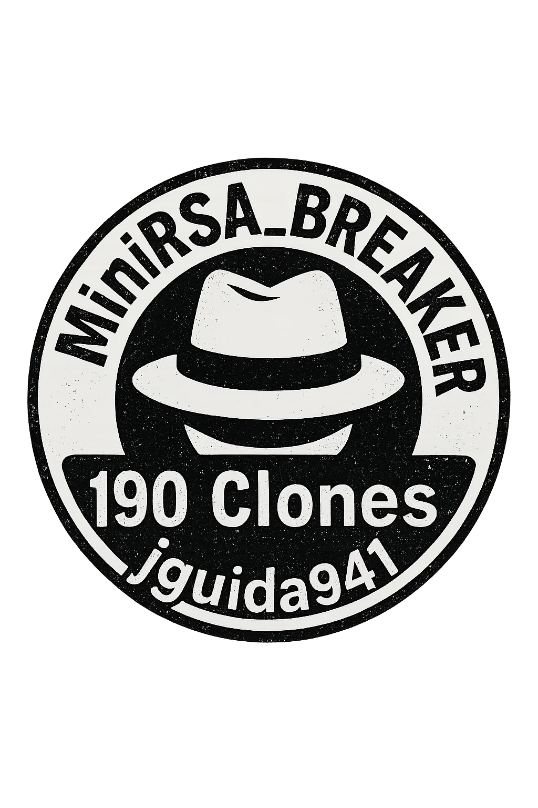

<table>
  <tr>
    <td>
      <h1>🔐 MiniRSA_Breaker</h1>
      <b>Category:</b> Cryptography / Educational Visualization  <br>
      <b>Tech Stack:</b> Python, PyQt6  <br>
      <b>Author:</b> <a href="https://github.com/jguida941">Justin Guida</a>  <br>
      <b>Resume:</b> <a href="https://profile.indeed.com/p/justing-yqigd8r">View My Live Resume on Indeed →</a>
      <br>
      <b> White Hat Verified 🧢 </b>
    </td>
    <td align="center" style="min-width: 140px;">
      <a href="https://github.com/jguida941/MiniRSA_Breaker">
        
      </a>
    </td>
  </tr>
</table>


<br>

**🌀This project enables interactive RSA encryption and decryption**, with full step-by-step visual feedback.  
<br>
**Build understanding** through math, logic, and real cryptographic theory.  
**All students and educators welcome.**

**Use it to:**
<br>
<br>
     -**📚Teach** RSA key concepts  
     <br>
     -**🔍 Break down** modular exponentiation  
     <br>
     -**🛡️Compare** weak vs. strong keys

Whether you're a **teacher**, a **CS student**, or just **someone fascinated by how passwords work**, **this tool was built for you**  

⚠️ This won't **teach you how** to break secure RSA encryption.  
    But... with the **right math and curiosity**, that’s a different story.🔓


<br>


# ⚡ Features

**RSA Key Generation**  
Generate custom or random small prime keys instantly.

**Modular Exponentiation Engine**  
Performs `c = m^e mod n` and `m = c^d mod n` using Python’s `pow()` function, real, fast RSA behavior.

**Character Mapping System**  
Maps characters **A–Z** to integers **01–26**, with optional symbol support for extended messages.

**Encryption & Decryption Panels**  
Visualize the full message transformation — from plaintext to ciphertext and back,  in real time.

**Step-by-Step Math Breakdown**  
Each stage of RSA math is clearly explained and animated for learning purposes.

**Error Handling + Input Validation**  
Smart checks catch invalid primes, characters, and unsupported input types, with helpful messages.

**100% Offline Application**  
Runs entirely on your device , no web server, no uploads, just fast, secure local computation.

**Debug Mode & Educational Hints**  
Toggle debug mode to show raw values, intermediate results, and contextual explanations at every step.

# 📸 Screenshots

## Main Interface RSA Setup: Define primes, generate public/private keys, and view entropy ratings in real time.


---

## 🔐 Encryption Panel: Watch your message get encrypted character by character using modular exponentiation.


---

## 🕵️ Decryption Panel: Reverse the cipher text and view RSA logic in reverse using your private key.


---

# 🚀  How to Run:

# Follow these steps to launch **MiniRSA_Breaker** locally:

### 1. Clone the Repository
```bash
git clone https://github.com/jguida941/MiniRSA_Breaker.git
cd MiniRSA_Breaker
```

### 2. Create a virtual environment (recommended)
```bash
python3 -m venv venv
source venv/bin/activate  # On Windows: venv\Scripts\activate
```

### 3. Install dependencies
```bash
pip install -r requirements.txt
```

### 4. Launch the app
```bash
python rsa.py
```

<h2>🗑️🔥 How it <i>Really</i> Runs on macOS:</h2>

<p>
App runs fully offline, no network needed, just on Steve Jobs’ soul.<br>
Plus Spotlight probably bricked your system already.
</p>

<p><b>Step 1:</b> Be ready for <code>mds</code>, <code>mdworker</code>, <code>corespotlightd</code>, <code>sysmond</code> amd  
the whole squad to wake up like it’s <b>DEFCON 1</b> and starts re-indexing 48GB of RAM  
while you’re just trying to run a prime test.</p>

<pre><code>
[BOOT]     Initializing MiniRSA_Breaker v1337.420.69
[INFO]     Benchmarking Mode: ⚡ Mersenne Prime Detected. 1000GB to SSD — BRO.
[WARNING]  macOS daemons detected suspicious genius at PID 1337 
           Spotlight auto-enabled: why? Who fucking knows, Apple Bro.
[ALERT]    RAM leaking ideas per nanosecond cannot patch intelligence overflow
           Head Apple designer: “It’s design, bro.”
[SYS]      Spotlight tried to index thought… failed.
           iPhone camera 4x, bro. It's innonovation bro
[SYS]      launchd attempted to sandbox the Supreme Intelligence… denied.
[CRITICAL] GUI kernel at 98% CPU — M4 triggered kernel dump, 50GB of mental models.
[ALERT]    SYSTEM DESIGN OVERRIDE ENABLED — “Let’s keep it running tho. M4, bro.”
[ALERT]    ML mode activated without user consent.
[CRTICAL]  Thinking faster than TensorFlow
           ML model of Steve Jobs’ soul created. 
[DEBUG]    Logger overwhelmed , Steve brain too big.
[FAIL]     Apple M4 throttled due to raw IQ, still quiet tho, APPLE BRO
[INFO]     Transferring control to Steve.
[STATUS]   AI SUPER INTELLIGENCE ACHIEVED.
[CRITICAL] AI SUPER INTELLIGENCE : Spotlight re-indexing 
[STATUS]   Apple daemons attempting to re-index all of humanitys knowledge, 
           for fuck knows why.
[INFO]     Initializing vNEURAL_JOBS_1.0…  
[INPUT]    Detected: USB-C  REJECTED  
[INPUT]    Detected: AC Power REJECTED  
[SOURCE]   Sunlight → accepted ☀️  
[WARNING]  Model refuses to run in shade.  
[ERROR]    Energy source too artificial.  
[CRITICAL] ML model shut down in silent protest.  
[FATAL]    ML Final words: “Batteries are for cowards.”  
[BRO]      AI SUPER INTELLIGNECE DEAD BRO. Better take it to the apple store.
</code></pre>

<hr>

<h3>📄 License: <a href="https://creativecommons.org/licenses/by-nc/4.0/" target="_blank">CC BY-NC 4.0</a></h3>

<p>© 2025 <b>Justin Guida</b><br>
This project is licensed under the <b>Creative Commons Attribution-NonCommercial 4.0 International License</b>.</p>

<h4>You May:</h4>
<ul>
  <li><b>✅Share</b> — Copy, distribute, and share the code</li>
  <li><b>✅Adapt</b> — Remix, transform, or build upon it for personal or academic purposes</li>
</ul>

<h4> You May Not:</h4>
<ul>
  <li>❌ Use this work for commercial purposes</li>
  <li>❌ Sell, rebrand, or repackage this project for profit</li>
</ul>

<h4>📢 You Must:</h4>
<ul>
  <li>Credit the original author clearly:</li>
  <ul>
    <li><b>Name:</b> Justin Guida</li>
    <li><b>Year:</b> 2025</li>
    <li><b>GitHub:</b> <a href="https://github.com/jguida941" target="_blank">https://github.com/jguida941</a></li>
  </ul>
</ul>

<hr>

## <h3> 🎓Educational Use Terms</h3>
<ul>
  <li>Use this tool in lessons, demos, or assignments</li>
  <li>Modify and explore it freely for academic learning</li>
  <li>Ensure visible credit appears in repurposed or adapted materials</li>
</ul>

<h3> 🧠 Learn from the Best:</h3>
<ul>
  <li><a href="https://www.freecodecamp.org/" target="_blank">FreeCodeCamp: Scientific Python</a></li>
  <li><a href="https://cs50.harvard.edu/x/" target="_blank">Harvard CS50x 2024</a></li>
  <li><a href="https://en.wikipedia.org/wiki/Cryptography" target="_blank">Cryptographic Methods</a></li>
</ul>

<p style="font-size: 0.9em;">
 <i>Attribution link:</i> 
<a href="https://creativecommons.org/licenses/by-nc/4.0/" target="_blank">
https://creativecommons.org/licenses/by-nc/4.0/</a>
</p> 
